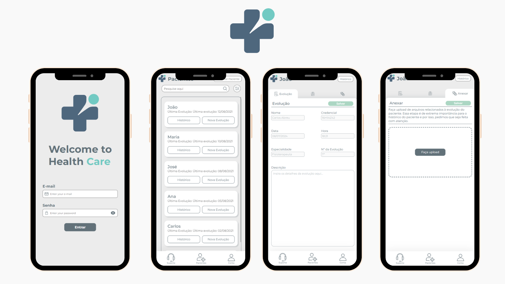

# Senior Care Project



## Description

The **Senior Care** project is an application developed for tracking and updating medical records in elderly care homes. It offers a solution that includes both frontend and backend, facilitating efficient management of health and care information for residents.

## Features

### Completed Features

- **Patient Management**:
  - Add new patients to the system, including all necessary personal and medical information.
  - Track the evolution of diagnoses over time, allowing for better care planning and monitoring of patient health.

- **Usage and Expense Reports**:
  - Generate detailed reports of medication and material usage by each patient.
  - Track expenses associated with each patient, providing a comprehensive view of healthcare costs.

### Planned Features (Roadmap)

- **Register Medications and Materials**:
  - **Registration**: Enable the registration of medications and materials with details such as name, brand, and price paid on the last purchase.
  - **Search Filters**: Implement filtering options to search medications and materials by brand (laboratory), name, and date of the last purchase.

- **Inventory Management**:
  - **Validation**: Develop a system to validate the output of medications and equipment by healthcare professionals.
  - **Automatic Output**: Automate the process of updating inventory levels when medications and materials are used or dispensed.

- **Management Approval Workflow**:
  - **Approval Process**: Create a workflow for management to approve, reject, or modify purchase requests.
  - **Authorization Display**: Display the purchase authorization in the pharmacy profile once the request is approved by management.

## Technologies Used

- **Backend**:
  - Node.js
  - NestJS
  - TypeScript

- **Frontend**:
  - React
  - Next.js
  - TypeScript

## How to Run the Project

### Prerequisites

- Node.js
- npm or yarn

### Steps to Run

1. **Clone the repository**:
   ```bash
   git clone https://github.com/themarcosf/senior-care-project.git
   cd senior-care-project
   ```

2. **Install dependencies** for the backend:
   ```bash
   cd backend
   npm install
   ```

3. **Start the backend server**:
   ```bash
   npm run start
   ```

4. **Install dependencies** for the frontend:
   ```bash
   cd ../frontend
   npm install
   ```

5. **Start the frontend server**:
   ```bash
   npm run dev
   ```

The application will be available at `http://localhost:3000`.